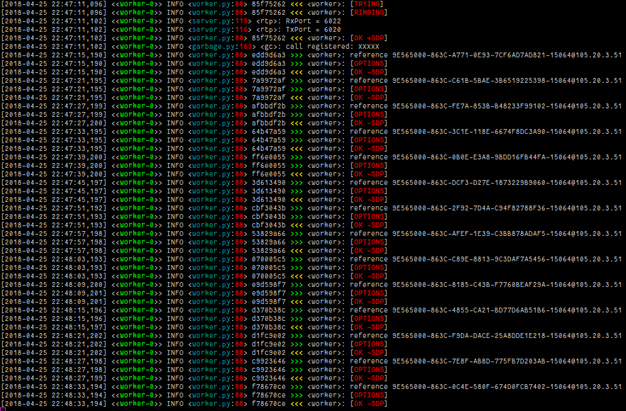
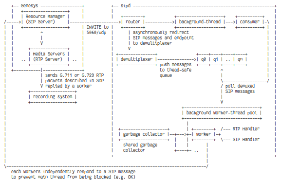

[](https://travis-ci.org/initbar/sipd)



**sipd** is an [active-recording](https://en.wikipedia.org/wiki/VoIP_recording) [Session Initiation Protocol](https://www.ietf.org/rfc/rfc3261.txt) daemon. A daemon is a background process that handles incoming requests and logically responds - and you can customize everything from custom SIP headers to handlers.

Some key features are:

- **High performance** using [reactor asynchronous design pattern](https://en.wikipedia.org/wiki/Reactor_pattern) and multi-core handlers.

- **Fast RTP routing** using dynamic [Session Description Protocol](https://en.wikipedia.org/wiki/Session_Description_Protocol) generation. I recommend using specialized [Real-time Transport Protocol](https://en.wikipedia.org/wiki/Real-time_Transport_Protocol) decoders to handle RTP payloads.

- **Maximum portability** implemented in native Python and [non-mandatory, minimal dependencies](./requirements.txt).

## Usage

[config.json](./config.json) is a mandatory configuration file that allows customization of the runtime environment. Although default settings is fine, it can be tuned for better performance.

```bash
~$ make
~$ ./sipd
```

## Tests

To run unit tests, type `make test`. If the test exists with exit status 0, then it's ready to be run!

```bash
~$ make test
```

## Design



## License

**sipd** is licensed under [GNU GPLv3](./LICENSE.md).
